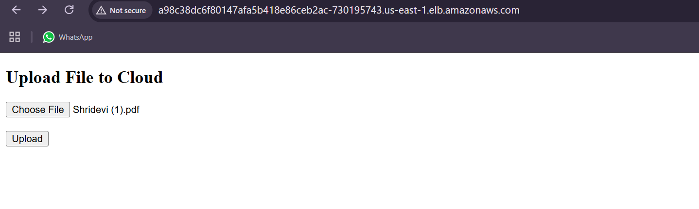
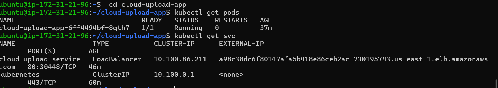
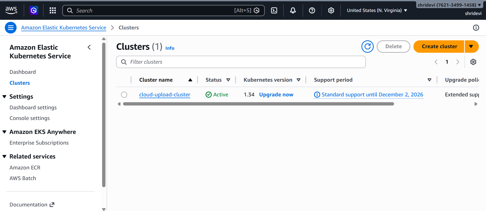
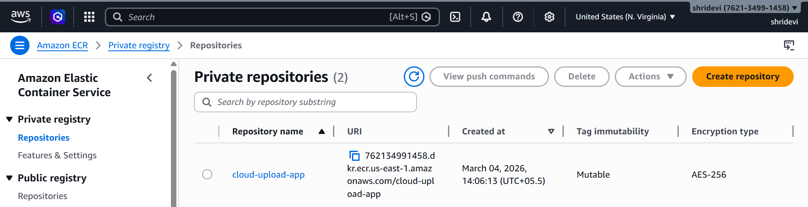
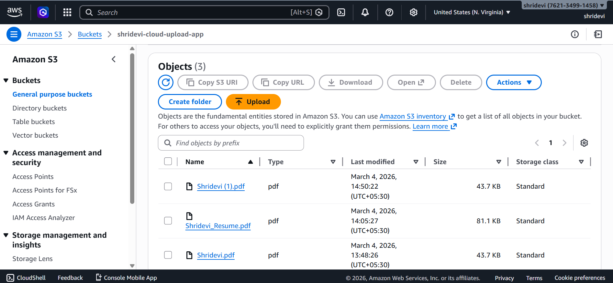
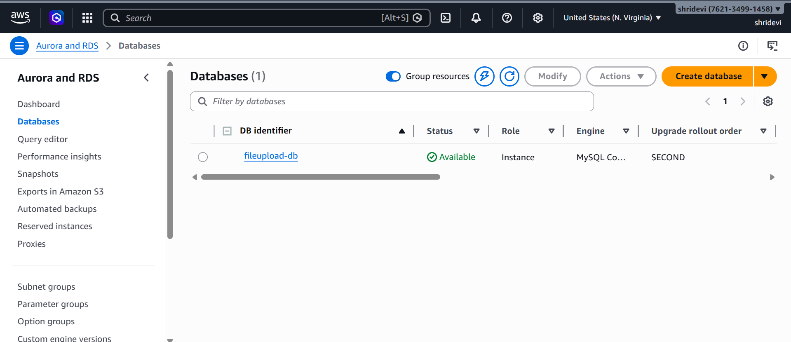

# Cloud-Native File Upload Application using AWS & Kubernetes

## Project Overview
This project demonstrates a cloud-native web application deployed using AWS and Kubernetes.  
The application allows users to upload files through a web interface. Uploaded files are stored in Amazon S3 and metadata is saved in an Amazon RDS MySQL database.

The application is containerized using Docker, stored in Amazon ECR, and deployed on Amazon EKS (Kubernetes) with a Load Balancer for external access.

---

## Architecture

User → AWS Load Balancer → Kubernetes Service (EKS) → Pods (Docker Containers) → Flask Application → Amazon S3 + Amazon RDS

```
           User
            │
            ▼
    AWS Load Balancer
            │
            ▼
     Kubernetes Service
            │
            ▼
       Kubernetes Pods
     (Docker Containers)
            │
            ▼
       Flask Web App
        │        │
        ▼        ▼
     Amazon S3   Amazon RDS
```

---

## Technologies Used

- AWS VPC – Network environment
- Amazon EC2 – Worker nodes for Kubernetes
- Amazon EKS – Managed Kubernetes cluster
- Amazon ECR – Docker container registry
- Amazon S3 – File storage
- Amazon RDS (MySQL) – Metadata database
- Docker – Containerization
- Python Flask – Backend web application
- Kubernetes – Container orchestration

---

## Features

- Upload files through a web interface
- Store files securely in Amazon S3
- Store file metadata in Amazon RDS MySQL
- Containerized application using Docker
- Deployed on Kubernetes using Amazon EKS
- Accessible through AWS Load Balancer

---

## Project Structure

```
cloud-upload-app
│
├── app.py
├── requirements.txt
├── Dockerfile
├── deployment.yaml
├── service.yaml
├── README.md
│
├── templates
│   └── index.html
```

---

## Docker Setup

Build Docker image

```
docker build -t cloud-upload-app .
```

Run Docker container

```
docker run -p 5000:5000 cloud-upload-app
```

---

## Kubernetes Deployment

Deploy the application

```
kubectl apply -f deployment.yaml
```

Create LoadBalancer service

```
kubectl apply -f service.yaml
```

Check running pods

```
kubectl get pods
```

Check service

```
kubectl get svc
```

---

## AWS Services Used

| Service | Purpose |
|------|------|
| Amazon S3 | File storage |
| Amazon RDS | MySQL database for metadata |
| Amazon ECR | Docker image storage |
| Amazon EKS | Kubernetes cluster |
| Amazon EC2 | Worker nodes |
| Elastic Load Balancer | Public access to the application |

---

## Screenshots

### Application Running



### Kubernetes Pods and Services



### EKS Cluster



### Docker Image in ECR



### S3 Bucket



### RDS Database
---


